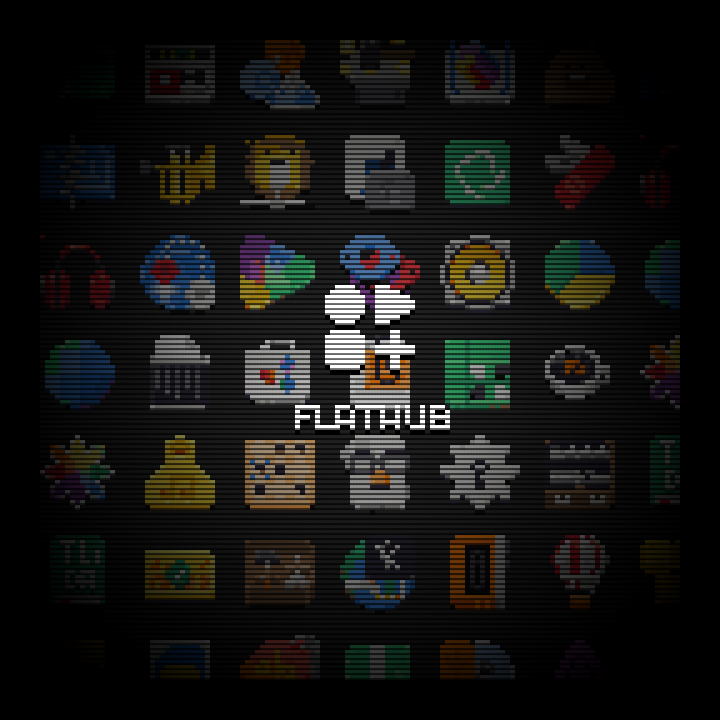

# GNOME Icons

A retro quiz game — can you name all 166 GNOME apps from their icons?



## Gameplay

- **D-pad / Arrow keys** — browse icons
- **A / X / Enter** — reveal the app name
- **B / Z / Space** — jump to a random icon

Icons are displayed one at a time on a virtual 128×128 pixel canvas scaled up to 720×720 with a full 80s CRT effect — scanlines, phosphor glow, RGB subpixels, vignette, and barrel distortion. Channel-switch glitches fire on navigation and random ambient VHS artifacts keep things interesting.

## Framework

Built with [LÖVE 2D](https://love2d.org/) (11.5) — a Lua game framework. The game renders to a tiny 128×128 virtual canvas, then scales 5× with nearest-neighbor filtering for a crisp pixel art aesthetic. GPU shaders handle the CRT overlay, transition effects, and glitch distortions.

### Font

[Departure Mono](https://departuremono.com/) — a pixel-perfect monospace font.

### Icons

32×32 RGBA PNGs of GNOME application icons, rendered from the [GNOME HIG](https://developer.gnome.org/hig/) icon set. Licensed under CC BY-SA 4.0.

## Running

### Desktop (Linux)

```bash
# Install LÖVE via Flatpak
flatpak install --user flathub org.love2d.love2d

# Run from source
flatpak run org.love2d.love2d .

# Or package and run
zip -r gnome-icons.love . -x "*.md" ".git/*" "cover.png" "*.sh"
flatpak run org.love2d.love2d gnome-icons.love
```

### Anbernic / KNULLI / PortMaster

The game runs on ARM handhelds via PortMaster's LÖVE 11.5 runtime.

1. Copy `gnome-icons.love` to `roms/ports/gnome-icons/` on the SD card
2. Copy `GNOME Icons.sh` to `roms/ports/`
3. Refresh gamelists in EmulationStation

### Replacing Sound Effects

The placeholder WAVs in `assets/sfx/` can be replaced with custom [sfxr](https://sfxr.me/) sounds:

| File | Trigger | Volume |
|------|---------|--------|
| `swoosh.wav` | Icon navigation | 50% |
| `glitch.wav` | Random ambient glitch | 15% |
| `reveal.wav` | Name reveal | 40% |

## Origin

Originally built as a [PICO-8](https://www.lexaloffle.com/pico8.php) multicart demo, ported to LÖVE 2D to fit all 166 icons in a single distributable file and run natively on ARM handhelds.

## License

Code: [GPL-3.0](https://www.gnu.org/licenses/gpl-3.0.html)  
Icons: [CC BY-SA 4.0](https://creativecommons.org/licenses/by-sa/4.0/)  
Font: [SIL Open Font License](https://departuremono.com/)

*jimmac.eu*
